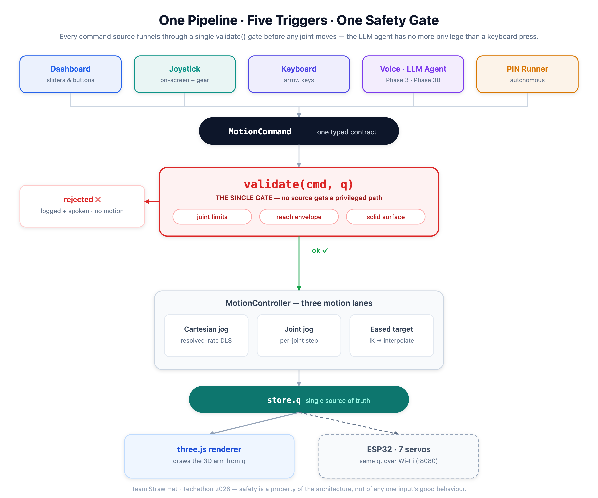

# Dry Run — Browser-Based Robotic-Arm Control Suite

**Team Straw Hat · Techathon 2026 Final Round (IUT Robotics Society)**

> 🔗 **Live demo:** https://techathon2026-straw-hat-final.vercel.app · 🎥 **Demo video:** _link on submission_

A 7-DOF stylus arm, simulated and driven entirely in the browser — **no backend, no hardware required**. Five different ways to command it (dashboard, on-screen joystick, keyboard, natural-language voice, and a fully autonomous PIN-typing routine) all flow through **one motion pipeline behind one safety gate**. Nothing gets a privileged path — the LLM agent is held to the exact same limit checks as a keyboard key press.

---

## Highlights

- **One pipeline, five triggers.** Dashboard, joystick, keyboard, voice, and the autonomous PIN runner all emit the same typed `MotionCommand` and pass through a single `validate()` gate before any joint moves.
- **Real inverse kinematics** — a Damped Least-Squares (DLS) resolved-rate solver, Jacobian finite-difference-verified against pure-TS forward kinematics.
- **Autonomous PIN entry** — give it a 6-digit PIN and the arm plans, descends onto, and taps each key on the 3D keypad, reporting per-key accuracy in millimetres.
- **Natural-language voice** — an offline deterministic grammar handles simple commands with zero API key; an optional Groq LLM agent plans multi-step utterances. Both are limit-checked identically.
- **Safety first** — every command is bounds-checked (joint limits, reach envelope, solid surface) *before* execution; rejections are logged and spoken, never silently executed.
- **The surface is solid** — no part of the arm may pass below the table, not just the tip. A jog held into the floor **slides to contact and stops flush**, and a joint move that is legal for the joint but would bury a link is refused outright.
- **Fully client-side & verifiable** — pure-TypeScript kinematics core with **62 passing unit tests**; the FK anchor `(0, 0, 1.497 m)` is proven independently of three.js.

---

## Architecture — one pipeline, five triggers



<sup>Vector source: [`docs/architecture.svg`](docs/architecture.svg)</sup>

<details>
<summary>Text version of the diagram</summary>

```
  Dashboard   Joystick   Keyboard   Voice / LLM Agent   PIN Runner
      │           │          │              │                │
      └───────────┴──────────┴──────┬───────┴────────────────┘
                                     ▼
                          ┌─────────────────────┐
                          │  MotionCommand       │   one typed contract
                          │  (discriminated union)│
                          └──────────┬───────────┘
                                     ▼
                          ┌─────────────────────┐
                          │   validate(cmd, q)   │   ◄── THE SINGLE GATE
                          │  joint limits ·      │       no source bypasses it
                          │  reach envelope ·    │
                          │  solid surface       │
                          └──────────┬───────────┘
                            ok │           │ rejected
                               ▼           ▼
                     ┌──────────────┐   logged + spoken,
                     │ MotionController│   no motion
                     │  3 motion lanes │
                     └────────┬───────┘
             ┌────────────────┼────────────────┐
             ▼                ▼                ▼
     Cartesian jog       joint jog       eased target
     (resolved-rate DLS) (per-joint)     (IK → interpolate)
             └────────────────┴────────────────┘
                              ▼
                    store.q  (single source of truth)
                              ▼
                 three.js renderer follows q  →  3D arm
```

</details>

**Why this matters:** the LLM agent, the mic, and the keyboard are all *just command sources*. They cannot move a joint the validator wouldn't allow. Safety is a property of the architecture, not of any one input's good behaviour. The Event Log makes this visible — every command, validation verdict, and key-touch result lands there with a source tag.

---

## The `MotionCommand` contract

Every input produces one of these; the controller and validator only ever see this shape (`src/core/commands.ts`):

| `type` | Payload | Meaning |
|---|---|---|
| `stop` | — | E-stop: release all jogs, clear target |
| `home` | — | Go to the zero pose `(0,0,1.497 m)` |
| `rotateJoint` | `joint`, `toRad` \| `deltaRad` | Absolute or relative single-joint move |
| `jogJoint` | `joint`, `deltaRad` | Continuous joint jog step |
| `jog` | `delta: [x,y,z]` | Discrete Cartesian tip nudge (IK-solved) |
| `moveTo` | `xyz`, `tipDown?` | Move the tip to a world point via IK |
| `touchKey` | `key` | Tap a keypad key (PIN sequence) |
| `typePin` | `pin` | Autonomous multi-key PIN entry |

Sources are tagged (`dashboard` · `joystick` · `keyboard` · `voice` · `agent` · `auto`) purely for logging — they get no behavioural privilege.

---

## Inverse kinematics

The arm is a 7-joint serial chain (`base yaw → shoulder → elbow → forearm roll → wrist pitch → tool roll → stylus pitch`), transcribed directly from the provided URDF. Straight-line reach ≈ 1.187 m from the shoulder.

- **Forward kinematics** — pure per-joint `Trans · Rot`, unit-tested against the ground-truth anchor `fk(0…0) = (0, 0, 1.497 m)`.
- **Jacobian** — position Jacobian, **finite-difference-verified** against FK in the test suite.
- **Solver** — **Damped Least-Squares (DLS)**, `dq = Jᵀ(JJᵀ + λ²I)⁻¹ · e`, λ = 0.08. Damping keeps it stable through singularities (e.g. the fully-vertical home pose, which is triply-singular — only ±X is first-order reachable there; the solver correctly damps rather than blowing up). Per-frame joint-step is capped and gear-scaled so even "Turbo" stays singularity-safe.
- **Resolved-rate Cartesian jog** — the same `JJᵀ` machinery drives the joystick/arrow-key tip jog each frame, velocity-smoothed (25 ms time constant) for soft starts and sub-100 ms stops.

---

## The surface is solid

The table isn't a backdrop the arm may sink through. `src/core/floor.ts` owns one rule and every lane enforces it:

- **Whole-arm, not just the tip.** The movable arm is modelled as the polyline *joint-1 origin → … → stylus tip*. Its links are straight segments and the surface is the plane `z = 5 mm`, so the minimum height over the polyline's **vertices is exactly** the minimum over the whole arm — no sampling along links needed. (The pedestal below joint 1 is fixed structure standing *on* the surface, so it's excluded.)
- **Refused at the gate.** A `rotateJoint` can sit happily inside its joint limit and still bury a link. Driving the shoulder to its −120° limit is rejected with *"stylus tip would reach −284 mm — the surface is solid (min 5 mm)"* — before any motion.
- **Slide to contact.** A jog held into the floor doesn't freeze early or tunnel through: `clampToFloor()` bisects the per-frame step so the arm comes to rest **flush** on the plane. Browser-verified: a 4.5 s joint jog and a 5 s Cartesian tip jog both stop at exactly **5.00 mm**, and the joint jog stops at −1.83 rad — short of its −2.09 limit, because the *surface* stopped it, not the joint.
- **IK solutions are checked too.** A target point above the floor can still have an IK pose that dips a link below it, so the solved pose is re-checked before it becomes the motion target.

## Autonomous PIN entry

Give it a 6-digit PIN; a state machine (`transit → settle → pure −Z descend → dwell → retract`) taps each key:

1. Precomputed hover pose per key (a reliability net so a live IK hiccup can't strand the sequence).
2. Descend straight down onto the key top (z = 50 mm cap face).
3. Success = FK of the *executed* pose within 5 mm of the key centre → green badge with the actual mm error; red if it missed.

Browser-verified: **PIN 156 → 3/3 keys within ~1 mm.** Esc aborts mid-sequence.

---

## Voice control — two independent panels

The rulebook is explicit: *"the optional agentic extension (Phase 3B) does not replace the required deterministic voice control (Phase 3) — baselines must still work independently and will be judged as such."* So they are **two separate panels**, each with its own mic and text box. Phase 3 never calls the LLM; Phase 3B is purely additive. Both funnel through the same `validate()` gate.

### Phase 3 — deterministic voice control (required)

`src/voice/VoicePanel.tsx` + `src/voice/grammar.ts` — offline, **no API key, zero network calls**, instant. Base frame is Z-up: *forward = +X (toward the keypad) · left = +Y · up = +Z*.

| Say | Does |
|---|---|
| "home" / "reset" | Go to zero pose |
| "stop" | E-stop |
| "rotate base 30 degrees" | Absolute joint rotation (default 15° if unstated) |
| "move up 2 cm" / "down" / "left" / "forward" / "back" | Cartesian tip nudge (default 2 cm) |
| "touch key 5" | Tap a keypad key |
| "enter pin 156" | Autonomous PIN entry |

An utterance the grammar can't parse is reported as such — it is **never** silently escalated to the LLM.

### Phase 3B — agentic voice control (optional extension)

`src/voice/AgentPanel.tsx` + `src/agent/` — for multi-step / free-form phrasing ("tap key 5 twice then lift 2 cm"). Groq `openai/gpt-oss-120b` (llama-3.3-70b fallback), JSON mode, temperature 0, **zod-validated plan**.

The whole plan is dry-run through `precheck()` — the identical `validate()` gate — *before anything moves*. A rejected plan gets **one** revision round with the validator's reasons fed back; if it still fails, the agent **executes nothing** and speaks a refusal. Ambiguous instructions get a clarifying question instead of a guess. Per-command status badges show `✓` / `✗ reason` live.

TTS speaks every confirmation and rejection aloud (Web Speech API).

> The API key is entered in-browser (or via `.env.local`) and stored only in `localStorage`. It is **never committed**. Phase 3 runs entirely without it — the key only enables the Phase 3B panel.

---

## Electrical schematic (Wokwi)

A Wokwi **ESP32** drives **7 servos** (one per joint), **remotely controlled over Wi-Fi** as the brief requires. [`firmware.ino`](hardware/firmware.ino) joins Wi-Fi and serves a TCP socket on `:8080` that accepts the app's joint vector (radians, the same `q[]` the web app prints), mapping each joint onto a 0–180° servo angle using the exact limits from [`src/core/chain.ts`](src/core/chain.ts); it idle-sweeps until a pose arrives. Wiring is in [`diagram.json`](hardware/diagram.json).


<sup>Conceptual block schematic ([vector source](hardware/system-diagram.svg)). The as-wired Wokwi circuit:</sup>


The circuit covers the rubric's four elements — **power delivery** (shared 5 V rail), **microcontroller/driver stage** (ESP32 + its PWM/`ESP32Servo`), **Wi-Fi link** (ESP32 `WiFiServer`), and labeled, consistent connections. Details, power budget, and run steps in [`hardware/README.md`](hardware/README.md).

---

## Run locally

```bash
npm install
npm run dev        # http://localhost:5173
npm run build      # tsc -b && vite build
npx vitest run     # 62 unit tests
```

Optional (enables the agentic voice layer only):

```bash
cp .env.example .env.local   # then paste your Groq key from console.groq.com
```

---

## Tech stack & attribution

React 19 · Vite · TypeScript (strict) · Tailwind CSS · **three.js** (MIT) · **urdf-loader** by gkjohnson (MIT) · zustand · zod · Web Speech API · Groq API · Wokwi. Provided assets: `stylus_arm.urdf`, `key.config.json`.

All application code was written from scratch during the event (no pre-written code reuse, per the rulebook).

---

## Team Straw Hat

| Member | Lane |
|---|---|
| Arif Shekh | Architecture · kinematics core · IK · PIN runner · joystick · integration |
| golammoula287 | Scaffold/render support · voice + LLM agent layer |
| Anamika-Mallick | Manual-control lane |
| Meherab (meherabmehu) | Voice layer · hardware |

---

## Challenges & future scope

- **Singularity handling** — the vertical home pose is triply-singular; DLS damping keeps the solver honest instead of exploding, and the UI badges "near reach limit" truthfully rather than faking motion.
- **One gate, many inputs** — the hardest and most valuable design choice was refusing to give any source (especially the LLM) a fast path around `validate()`.
- **Next:** orientation-aware (full 6-DOF pose) IK targets, trajectory preview before execution, and closing the loop to the Wokwi firmware over serial.
