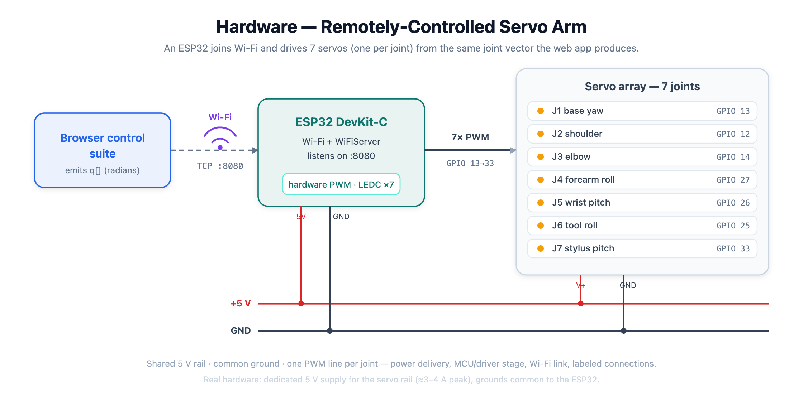
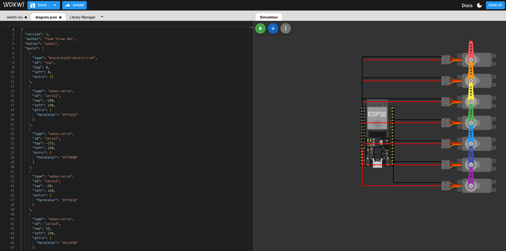

# Hardware — Wokwi electrical schematic & firmware

Phase 5 electrical PoC (rubric: **5%**). An **ESP32** microcontroller driving
**7 servos** — one per joint of the arm — **remotely controlled over Wi-Fi**, as
the problem statement requires.

## Block schematic

Vector source: [`system-diagram.svg`](system-diagram.svg)

## Files

| File | What it is |
|------|-----------|
| `system-diagram.svg` / `.png` | Conceptual block schematic — Wi-Fi link, ESP32 driver stage, 7 PWM lines, shared 5 V rail + common GND. |
| `diagram.json` | Wokwi circuit: **ESP32 DevKit** + 7 servos (PWM on GPIO 13/12/14/27/26/25/33), 5 V power rail, common GND. |
| `firmware.ino` | ESP32 sketch — joins Wi-Fi, serves a TCP socket on **:8080** that accepts the joint vector (radians), maps each joint to a 0–180° servo angle, and idle-sweeps until a pose arrives. |
| `libraries.txt` | Declares `ESP32Servo` so Wokwi / arduino-cli resolve the servo driver. |
| `wokwi-sim.png` | Screenshot of the as-wired Wokwi circuit (ESP32 + 7 servos, power + signal wiring). |

**As-wired in Wokwi:**

## How it maps to the rubric

The rubric asks the schematic to show **power delivery, a microcontroller/driver
stage, a Wi-Fi link, and labeled, consistent connections** — in a Wokwi diagram:

- **Microcontroller + Wi-Fi link** — an **ESP32** (Wi-Fi built in; antenna visible
  on the board). The firmware calls `WiFi.begin(...)` and runs a `WiFiServer` on
  port 8080, so the browser control pipeline drives the arm **over the network** —
  exactly the "remotely controlled over Wi-Fi" requirement an Arduino Uno can't meet.
- **Driver stage** — the ESP32's hardware PWM (LEDC) channels generate the servo
  control pulses; the `ESP32Servo` library maps 0–180° to 500–2400 µs.
- **Power delivery** — a common **5 V rail** (red) feeds every servo's V+, grounds
  tied to the ESP32 GND. See the power note below for the real-hardware supply.
- **Labeled, consistent connections** — each servo's PWM → a distinct GPIO, all V+ →
  5 V, all GND → GND; see `diagram.json`.

## Verification

- **Diagram** — loads and renders correctly in Wokwi: the `board-esp32-devkit-c-v4`
  and all 21 connections (7 PWM + 7 V+ + 7 GND) resolve with no unknown-part or
  wiring errors (see `wokwi-sim.png`).
- **Firmware** — standard ESP32 Arduino code (`WiFi.h` from the ESP32 core +
  `ESP32Servo`). The identical joint-mapping + sweep logic was earlier confirmed
  **running** on an Arduino Uno build (servos sweeping, serial banner); the ESP32
  version adds the Wi-Fi transport on top of that proven control loop.
- *Note:* a full live ESP32 **simulation** run wasn't captured at submission time —
  Wokwi's free build queue was saturated ("Build Servers Busy"). The circuit is
  valid and the sketch is standard; press ▶ in Wokwi when the queue is free to see
  the servos sweep and the serial print `... online over Wi-Fi @ <ip>`.

## How to run it yourself

1. [wokwi.com](https://wokwi.com) → **New Project → ESP32**.
2. Paste `firmware.ino` into `sketch.ino`, `diagram.json` into the diagram tab, and
   add the **ESP32Servo** library (Library Manager → `+` → ESP32Servo; also in
   `libraries.txt`).
3. Press **Play**. The ESP32 connects to the simulated `Wokwi-GUEST` network, the
   Serial Monitor (115200) prints the IP, and the 7 servos sweep.
4. To drive a pose over Wi-Fi, connect to the printed IP on port 8080 and send a
   joint vector in radians — the same `q[]` the web app prints, e.g.
   `[0.0, 1.15, 0.75, 0.0, 0.95, 0.0, 0.45]`.

Joint order matches `src/core/chain.ts`: base yaw · shoulder · elbow · forearm
roll · wrist pitch · tool roll · stylus pitch.

## Power note

7× SG90-class servos draw ~100–250 mA idle and can spike to ~600 mA–1 A at stall
→ up to ~3–4 A worst case. **Real hardware needs a dedicated 5 V supply** for the
servo V+ rail (not the ESP32's onboard regulator), with grounds common to the
ESP32. Wokwi doesn't model this current, so the diagram shows the shared 5 V rail.
